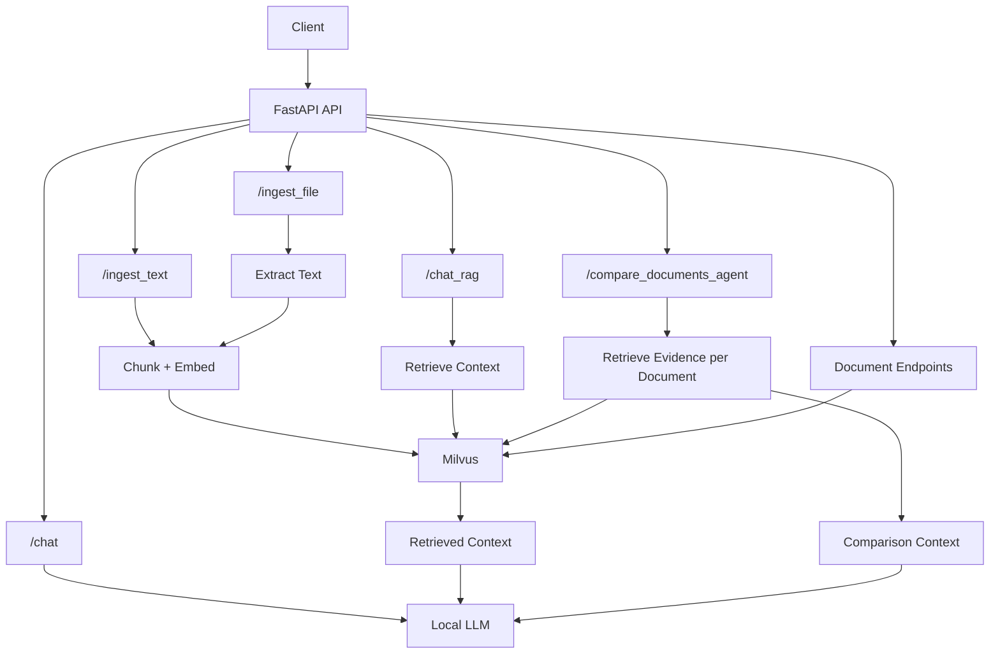

# LLM Mini Server

A local **RAG (Retrieval-Augmented Generation)** backend built with **FastAPI**, **Milvus**, **sentence-transformers**, and a local LLM.

The project supports document ingestion, semantic search, source-grounded question answering, and document comparison over locally indexed documents.

## Overview

LLM Mini Server provides:

* plain local LLM chat
* text and file ingestion into a vector store
* RAG-based question answering over indexed documents
* document comparison over indexed documents
* persistent vector search with Milvus
* document lifecycle management

## Architecture


```mermaid
graph TD
    User["Client"] --> API["FastAPI API"]

    API --> Chat["/chat"]
    Chat --> LLM["Local LLM"]

    API --> TextIngest["/ingest_text"]
    TextIngest --> Embed["Chunk + Embed"]

    API --> FileIngest["/ingest_file"]
    FileIngest --> Extract["Extract Text"]
    Extract --> Embed

    Embed --> Store["Milvus"]

    API --> Rag["/chat_rag"]
    Rag --> Retrieve["Retrieve Context"]
    Retrieve --> Store
    Store --> Context["Retrieved Context"]
    Context --> LLM

    API --> Compare["/compare_documents_agent"]
    Compare --> CompareRetrieve["Retrieve Evidence per Document"]
    CompareRetrieve --> Store
    CompareRetrieve --> CompareContext["Comparison Context"]
    CompareContext --> LLM

    API --> Docs["Document Endpoints"]
    Docs --> Store
```

## Features

### Local LLM Chat

The `/chat` endpoint sends a prompt directly to the local language model.

This mode is used for general, non-document-based responses.

### RAG Chat

The `/chat_rag` endpoint performs document-aware question answering over indexed content.

The RAG workflow includes:

1. embedding the user question
2. retrieving relevant chunks from Milvus
3. filtering duplicate or low-quality context
4. building a context window from retrieved chunks
5. generating a grounded answer with source metadata

### Document Comparison Agent

The `/compare_documents_agent` endpoint compares two indexed documents using retrieved evidence from each document.

The comparison workflow includes:

1. validating the comparison request
2. retrieving evidence separately for each document
3. building a comparison context with citation labels
4. generating a structured comparison with the local LLM
5. returning a summary, recommendation, winner, comparison items, gaps, risks, next actions, and sources

The request accepts two document references, an optional list of comparison criteria, `top_k_per_document`, and `debug`.

### Text and File Ingestion

The `/ingest_text` endpoint accepts raw text directly.

The `/ingest_file` endpoint accepts supported files, extracts their text content, and sends the extracted text through the same chunking, embedding, and storage pipeline.

The ingestion pipeline includes:

* input validation
* text extraction from supported files
* support for `.txt`, `.md`, and `.pdf` files
* text chunking with overlap
* embedding generation
* vector store upsert
* metadata tracking by document ID and chunk index

### Persistent Vector Store

The project uses **Milvus** as the persistent vector database for storing and searching embedded document chunks.

Stored chunk data includes:

* chunk ID
* chunk text
* embedding vector
* document ID
* chunk index

### Document Lifecycle Management

The API includes endpoints for managing indexed documents:

* list indexed documents
* delete a document by `doc_id`
* clear all stored documents

## API Endpoints

| Method   | Endpoint                   | Description                                             |
| -------- | -------------------------- | ------------------------------------------------------- |
| `POST`   | `/chat`                    | Plain local LLM response                                |
| `POST`   | `/chat_rag`                | RAG response using all documents or a specific `doc_id` |
| `POST`   | `/compare_documents_agent` | Compare two indexed documents using retrieved evidence  |
| `POST`   | `/ingest_text`             | Ingest raw text into the vector store                   |
| `POST`   | `/ingest_file`             | Ingest an uploaded file into the vector store           |
| `GET`    | `/documents`               | List indexed documents                                  |
| `DELETE` | `/documents/{doc_id}`      | Delete a document by ID                                 |
| `POST`   | `/documents/clear`         | Clear all indexed documents                             |

## Tech Stack

* **Backend:** FastAPI, Pydantic, Uvicorn, Python
* **LLM / Embeddings:** Hugging Face Transformers, sentence-transformers, local instruction-tuned LLM
* **Agent workflow:** LangGraph
* **Vector database:** Milvus, Attu
* **Infrastructure:** Docker, Docker Compose
* **Testing:** pytest, FastAPI TestClient, unittest / mocking

## Setup

### 1. Clone the repository

```bash
git clone https://github.com/RomanSafovich/llm-mini-server.git
cd llm-mini-server
```

### 2. Build the API image

```bash
docker build -f Docker/Dockerfile -t llm-mini-server .
```

### 3. Start the stack and follow API logs

```bash
docker-compose -f Docker/docker-compose.yml up -d && docker logs -f llm-api
```

### 4. Stop the stack

```bash
# Press Ctrl+C to exit the Docker logs stream first
docker-compose -f Docker/docker-compose.yml down
```

## Example Usage

### Ingest text

```http
POST /ingest_text
```

Example request:

```json
{
  "doc_id": "rag_notes",
  "text": "Milvus is used as the persistent vector store for semantic retrieval..."
}
```

### Ingest a file

```http
POST /ingest_file
```

Example form data:

```text
doc_id: rag_notes_file
file: notes.md
```

### Ask a RAG question across all documents

```http
POST /chat_rag
```

Example request:

```json
{
  "question": "What vector database does this project use?",
  "top_k": 5,
  "debug": true,
  "doc_id": null
}
```

### Ask a RAG question for a specific document

```http
POST /chat_rag
```

Example request:

```json
{
  "question": "What vector database does this project use?",
  "top_k": 5,
  "debug": true,
  "doc_id": "rag_notes"
}
```

### Compare two documents

```http
POST /compare_documents_agent
```

Example request:

```json
{
  "question": "Which document gives a stronger explanation of the retrieval design?",
  "documents": [
    {
      "doc_id": "rag_notes",
      "label": "RAG notes"
    },
    {
      "doc_id": "implementation_notes",
      "label": "Implementation notes"
    }
  ],
  "criteria": [
    "relevance to the question",
    "specific evidence",
    "risks or missing details"
  ],
  "top_k_per_document": 5,
  "debug": false
}
```

### Ask a plain chat question

```http
POST /chat
```

Example request:

```json
{
  "prompt": "Explain what cosine similarity means."
}
```

## Running Tests

Run the test suite with:

```bash
pytest
```

## Project Goals

LLM Mini Server is built to run local RAG workflows without relying on external LLM APIs.

The project is designed to:

* keep the API small and easy to understand
* support local document ingestion and retrieval
* use a persistent vector database instead of in-memory storage
* separate plain chat, RAG chat, and future agent workflows
* stay modular enough to extend over time

## Planned Improvements

Future improvements may include:

* query rewriting, hybrid search, and reranking
* improved source formatting
* conversation memory
* simple UI for chat and document management

## Future Agent Direction

A future `/research_agent` endpoint is planned for multi-step document research.

The current endpoint design is:

* `/chat` — plain local LLM response
* `/chat_rag` — single retrieval + grounded answer
* `/compare_documents_agent` — evidence-based comparison of two indexed documents
* `/research_agent` — multi-step retrieval and reasoning over documents

This keeps the existing API simple while leaving room for additional controlled tool-using agent workflows later.

## License

This project is licensed under the Apache 2.0 License.
